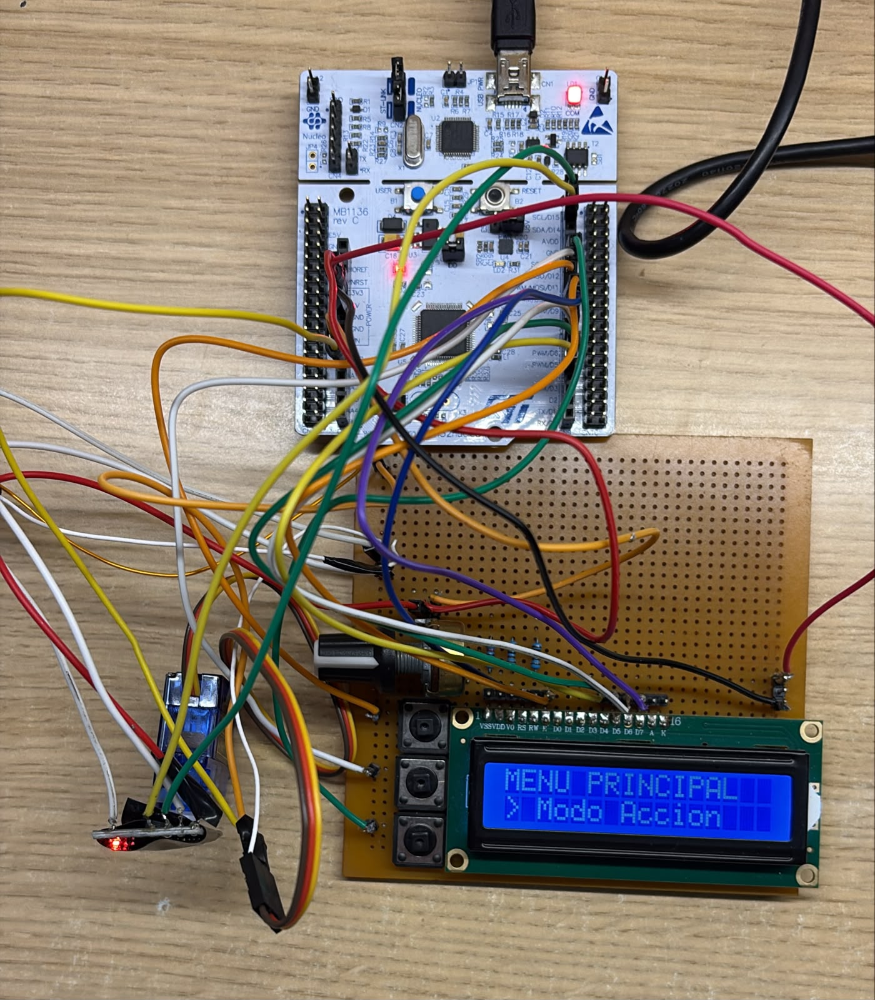
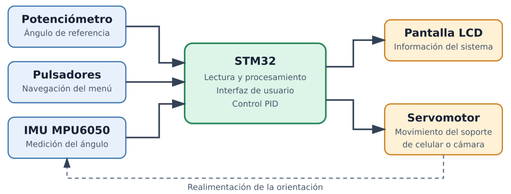
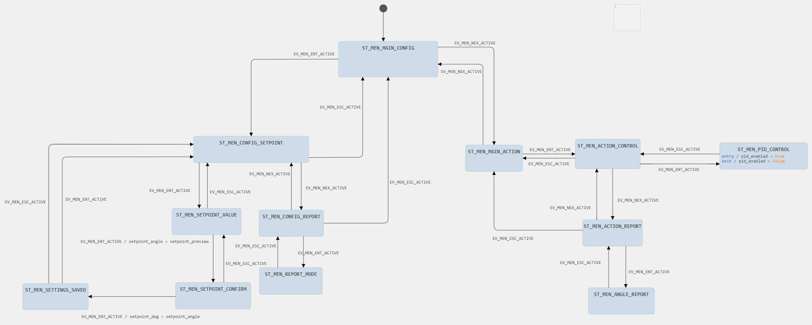

# Estabilizador configurable de celular

### Trabajo final de **Sistemas Embebidos (TA134)** — FIUBA, primer cuatrimestre de 2025.
#### Autores: Tomás Grassi y Tiago Sandoval.

Un soporte para celular o cámara montado sobre el brazo de un servomotor, que mantiene
la inclinación que el usuario elija aunque lo muevan desde afuera. Una IMU montada sobre
el brazo mide el ángulo real respecto de la vertical, el firmware lo compara contra la
referencia configurada y corrige la posición del servo. Un menú en un LCD de 16×2, tres
pulsadores y un potenciómetro completan la interfaz.

Corre sobre una **Nucleo-F103RB**, sin RTOS: el planificador es un
organizador de tareas cooperativo disparado por tiempo.

**[Video de demostración del prototipo](https://drive.google.com/file/d/1DnxUwtQ0pkcxPbQV9M1MjrnZFqsFmkMK/view?usp=sharing)**



## Cómo funciona



La `MPU6050` se lee por I2C en una sola ráfaga de 14 registros, así las seis componentes
corresponden al mismo instante de muestreo. Con eso se estima el ángulo, se lo compara
contra la referencia y se corrige la posición del servo.

### Estimación del ángulo: filtro complementario

Ninguno de los dos sensores sirve solo. El acelerómetro da la inclinación absoluta a
partir de la dirección de la gravedad y no acumula error con el tiempo, pero se ensucia
con cualquier aceleración que no sea la gravedad — es decir, justo con el movimiento que
el sistema tiene que corregir. El giróscopo mide velocidad angular y responde al toque,
pero hay que integrarlo, y esa integral deriva.

El filtro los combina con un solo coeficiente (`task_imu.c`):

```c
accel_tita  = atan2f(ax_g, ay_g) * 180.0f / M_PI;
tita_deg    = alpha * (tita_prev_deg + gz_dps * dt) + (1.0f - alpha) * accel_tita;
```

El término de la izquierda es la estimación anterior actualizada con el giróscopo; el de
la derecha reinyecta la del acelerómetro con poco peso. En la práctica es un pasaaltos
sobre el giróscopo y un pasabajos sobre el acelerómetro, con `alpha = 0.98`. Se usa
`atan2` y no un cociente simple porque conserva el cuadrante y no se indetermina cuando
una de las componentes se anula.

Dos detalles que no se ven en la fórmula:

- **El `dt` se mide, no se supone.** La lectura I2C es bloqueante y demora ~1,6 ms, así
  que las tareas no corren a un período fijo. Cada iteración calcula el intervalo real con
  `HAL_GetTick()`.
- **`alpha` y el período de muestreo van juntos.** La constante de tiempo del cruce vale
  `alpha·dt/(1−alpha)`, unos 100 ms con el `dt` actual. Si cambiás la frecuencia de
  ejecución de la tarea, hay que recalcular `alpha` para conservar el comportamiento.

La salida se corrige con un offset fijo para que 0° sea la vertical, y cada lectura
fallida del bus se refleja en `imu_ok`: no se inventa un valor por defecto, se avisa y
cada consumidor decide qué hacer.

### Ley de control

Como la IMU está montada sobre el brazo, mide la inclinación absoluta sin importar si la
causó el servo o una perturbación externa. Eso permite cerrar con realimentación unitaria
simple, sin llevar la cuenta por separado del movimiento propio.

El controlador es **incremental**: no calcula la posición absoluta que debe adoptar el
servo, sino la corrección que se le suma a la última posición comandada (`task_servo.c`):

```c
error   = setpoint_deg - tita_deg;
if (fabsf(error) < DEADBAND_DEG) error = 0.0f;      // banda muerta
integral = clampf(integral + error * dt, -INTEGRAL_CLAMP, INTEGRAL_CLAMP);
delta    = clampf(KP * error + KI * integral, -MAX_RATE * dt, +MAX_RATE * dt);
cur_cmd_deg = clampf(cur_cmd_deg + delta, SERVO_CTRL_MIN_DEG, SERVO_CTRL_MAX_DEG);
```

La forma incremental es la natural para esta planta: la relación entre el ángulo del brazo
y el ángulo comandado depende del montaje y no se conoce con exactitud, y trabajando así
el lazo la absorbe como una ganancia más, sin necesidad de calibrarla.

| Parámetro | Valor | Por qué |
|---|---|---|
| `KP` | 0,07 | El mayor valor que no produce oscilación sostenida |
| `KI` | 0 | Anulado tras el ajuste: no hacía falta y agregaba sobrepaso |
| `DEADBAND_DEG` | 1,0° | Sin banda muerta el servo zumba permanentemente por el ruido de la estimación. Coincide con la resolución con la que el usuario fija la referencia |
| `MAX_RATE_DEG_PER_SEC` | 600 °/s | Limitador de velocidad; es el parámetro de seguridad principal, acota el movimiento ante un error grande o una lectura anómala |
| `INTEGRAL_CLAMP` | ±20 | Anti-windup, por si se reactiva la acción integral |
| `SERVO_CTRL_MIN/MAX_DEG` | 10°–170° | Margen respecto de los topes mecánicos |

Con `KI = 0` y sin acción derivativa, lo que corre efectivamente es una **acción
proporcional sobre una formulación incremental**. La estructura integral quedó en el
código, con su anti-windup, para futuros ajustes. Derivativa no se puso: la propia forma
incremental amortigua la respuesta y el limitador de velocidad ya cumple la función de
acotar la agresividad ante errores grandes. Los valores de la tabla están atados a la
frecuencia de ejecución actual — si cambia, hay que reajustarlos desde cero.

El servo se mueve únicamente mientras el usuario está en la pantalla *Control PID*. En
cualquier otra pantalla el lazo queda inhibido, el acumulador integral se descarga y el
brazo conserva la última posición. Lo mismo si `imu_ok` es falso.

## Menú



Doce estados, uno por pantalla. El criterio de los pulsadores es el mismo en todos los
niveles: **NEX** recorre las opciones de un nivel, **ENT** baja o confirma, **ESC**
vuelve. El ángulo de referencia se ajusta con el potenciómetro y se confirma en dos
pasos, así un toque accidental no cambia el punto de operación.

El valor confirmado vive en RAM: se pierde al resetear. No hay persistencia en flash.

## Hardware

| Periférico | Pines | Detalle |
|---|---|---|
| IMU MPU6050 | PB8 / PB9 (D15 / D14) | I2C1 remapeado, 100 kHz, dirección `0x68` |
| Servo SG90 | PA1 (A1) | TIM2 CH2, 50 Hz, pulso de 1000–2000 µs |
| Potenciómetro 10 kΩ | PA0 (A0) | ADC1 canal 0, mapeado a −30°…+30° |
| Pulsadores ENT / NEX / ESC | PB6 / PA7 / PA6 (D10 / D11 / D12) | Activos por nivel bajo, pull-up interno |
| LCD 16×2 | PB5, PB4, PB10, PA8 + PA9, PC7 | HD44780 en 4 bits, RW a masa |
| Consola | PA2 / PA3 | USART2, 115200 8N1 (usado durante *debug*) |

El I2C1 está remapeado a PB8/PB9. El servo se alimenta desde una fuente externa de 5 V con masa común, para evitar picos de corriente en la placa. El sistema corre a 8 MHz (HSI/2 × PLL×2).

## Estructura del repositorio

```
app/inc/, app/src/          lógica de la aplicación
  app.c                     planificador y tabla de tareas
  task_sensor.c             antirrebote de los pulsadores (máquina de estados)
  task_imu.c                lectura de la IMU y filtro complementario
  task_servo.c              ley de control y generación del PWM
  task_menu.c               navegación, LCD y lectura del potenciómetro
  display.c                 driver del LCD
app/tabla-de-transiciones.md   tablas de transición de ambas máquinas de estado
app/statechart.scm             modelo del menú hecho en Itemis CREATE
tools/axis_calibration.py      análisis offline de los ensayos de calibración de eje
Core/, Drivers/                código generado por CubeMX y HAL
```

Las cuatro tareas se comunican únicamente a través de la estructura `shared_data`, y cada
campo tiene un solo productor. No hay llamadas directas entre tareas.

## Compilar

Se abre con **STM32CubeIDE** (proyecto en la raíz del repo). Hace falta generar una
configuración de ejecución propia: el `.launch` no está versionado.

En `app/inc/app.h`, la macro `TEST_X` elige qué se compila (diversas pruebas de funcionamiento de los módulos):

| Modo | Para qué |
|---|---|
| `TEST_PROD` | Funcionamiento normal, lazo cerrado |
| `TEST_IMU_ONLY` | Solo IMU y filtro, sin mover el servo |
| `TEST_SERVO_ONLY` | Barrido del servo en lazo abierto |
| `TEST_I2C_SCAN` | Recorre las 127 direcciones del bus y reporta cuáles responden |
| `TEST_AXIS_CAL` | Barrido preprogramado + registro de los 6 canales crudos de la IMU, para utilizar en conjunto con `tools/axis_calibration.py` para encontrar el eje correcto de la IMU |

La orientación de los ejes de la IMU se determinó empíricamente con `TEST_AXIS_CAL`: en la posición en que fue montado, el
eje de giro es el Z del sensor y la inclinación sale de `atan2(ax, ay)`. **Si se coloca
la IMU en otra posición, hay que rehacer esa calibración.**
